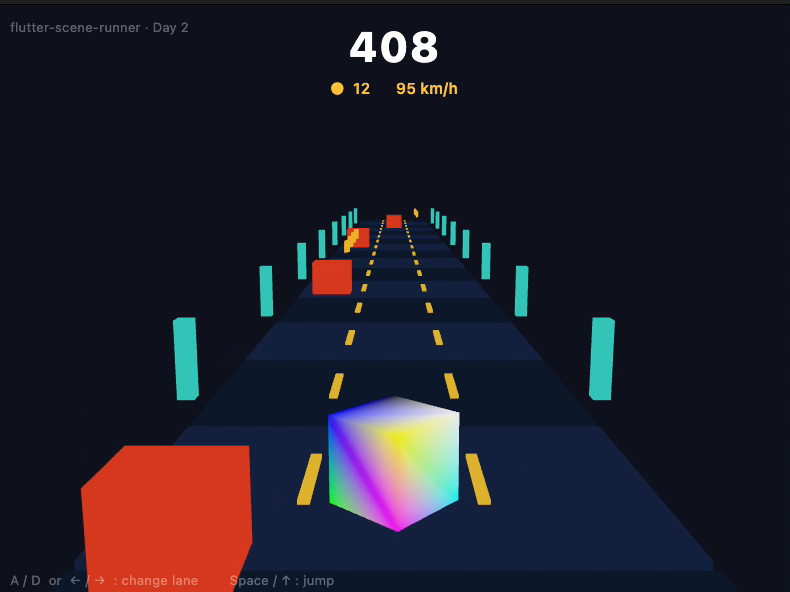
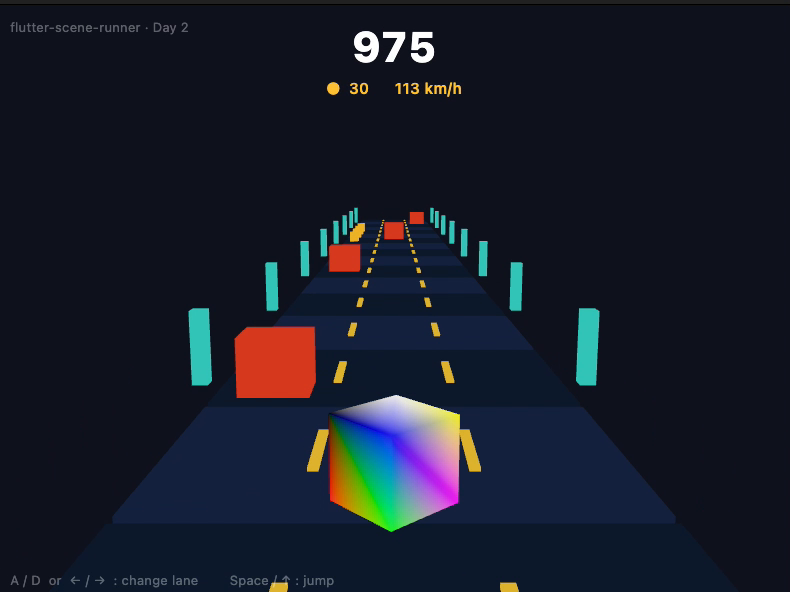
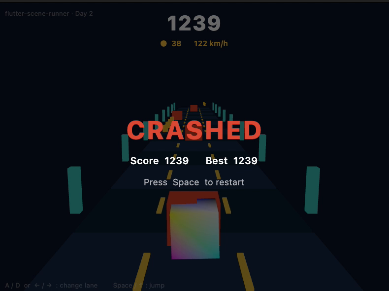

<div align="center">

# flutter-scene-runner

### لعبة ثلاثية الأبعاد (3D) مبنية بالكامل بـ Flutter — من غير أي محرّك ألعاب


<p>
  
  
  
  
</p>

**أحمد  الفرجاني** — Senior Flutter Engineer
<br/>
<a href="https://github.com/saqrelfirgany">GitHub</a> • <a href="https://www.linkedin.com/in/ahmed-elfirgany-a71635396/">LinkedIn</a>

</div>

<div dir="rtl">

## نظرة سريعة

`flutter-scene-runner` لعبة **Endless Runner ثلاثية الأبعاد**: تتحكّم في شخصية بتجري في طريق بثلاث حارات، تتفادى العوائق، تجمع العملات، والسرعة بتزيد مع الوقت. الحاجة اللافتة إن **كل إطار في اللعبة — الطريق، الشخصية، العوائق، والعملات — عبارة عن 3D حقيقي بيترسم مباشرةً على كارت الرسوميات (GPU) من Dart**، باستخدام `flutter_scene` فوق Flutter GPU / Impeller.

مفيش Unity، ولا Unreal، ولا حتى Flame — **Flutter بس**، من الصفر: scene graph و render loop مكتوبين بالإيد.

> **ليه المشروع ده؟** أغلب الناس لسه شايفة إن Flutter للتطبيقات وبس. المشروع ده بياخده لأبعد نقطة — رسم 3D لحظي على الـ GPU — عشان نكتشف حدود الأداة الحقيقية. أسرع طريقة تفهم أداة هي إنك تاخدها لأقصاها.

</div>

## لقطات من اللعب

<div align="center">
  <table>
    <tr>
      <td align="center"><br/><sub>الجري وجمع العملات</sub></td>
      <td align="center"><br/><sub>السرعة بتزيد</sub></td>
      <td align="center"><br/><sub>نهاية اللعبة</sub></td>
    </tr>
  </table>
  <sub>▶️ الفيديو الكامل: <a href="assets/day2.mp4">assets/day2.mp4</a></sub>
</div>

<div dir="rtl">

## المميزات

- **3D حقيقي على Flutter GPU** — رسم عبر `Scene.render()` جوه `CustomPainter` مدفوع بـ `Ticker` بسرعة تحديث الشاشة.
- **ثلاث حارات** بتنقّل ناعم ومستقل عن معدّل الإطارات، وقفزة بفيزياء جاذبية.
- **عالم لا نهائي** — تدوير ذكي لمجموعة ثابتة من عناصر الطريق (بلاطات، خطوط، أعمدة جانبية) يخلق مسارًا بلا نهاية من عدد محدود من الكائنات.
- **عوائق واصطدام** — عوائق تظهر عشوائيًا مع فحص تصادم (AABB) بيراعي حارتك وارتفاع قفزتك.
- **عملات، سكور، وتصاعد سرعة** — صفوف عملات قابلة للجمع، شريط معلومات حي (سكور · عملات · km/h)، وصعوبة بتزيد كل ما تسرّع.
- **أعلى سكور محلي**، وإعادة فورية بعد الاصطدام.

</div>

## التحكّم

<div align="center">
  <table>
    <tr><th>الإجراء</th><th>الأزرار</th></tr>
    <tr><td align="center">تغيير الحارة</td><td align="center"><code>A</code> / <code>D</code> — <code>←</code> / <code>→</code></td></tr>
    <tr><td align="center">القفز</td><td align="center"><code>Space</code> / <code>↑</code></td></tr>
    <tr><td align="center">إعادة (بعد الاصطدام)</td><td align="center"><code>Space</code></td></tr>
  </table>
</div>

<div dir="rtl">

## التقنيات

- **[flutter_scene](https://pub.dev/packages/flutter_scene)** — scene graph ثلاثي الأبعاد واستيراد glTF لـ Flutter (early preview).
- **Flutter GPU + Impeller** — طبقة الرسم منخفضة المستوى (Metal على macOS).
- **Flutter (قناة master) + Dart** — اللعبة كلها، منطق ورسم، Dart خالص.
- **vector_math** — تحويلات المتجهات والمصفوفات ثلاثية الأبعاد.

منطق اللعبة والرسم في ملف Dart واحد خفيف: `Scene` يُبنى مرة واحدة، تحديث بخطوة زمنية ثابتة داخل `Ticker`، و`CustomPainter` بيعيد وضع كل كائن كل إطار وينادي `scene.render(camera, canvas)`.

## التشغيل محليًا

`flutter_scene` بيتطلب قناة **`master`** و Flutter GPU، فالمشروع بيثبّت نسخته بـ [FVM](https://fvm.app) عشان يفضل معزول عن مشاريعك المستقرة.

</div>

```bash
# 1) Flutter master via FVM (a build from 2026-06-09 or newer)
fvm install master
fvm use master

# 2) one-time: enable the native-assets shader bundle
fvm flutter config --enable-native-assets --enable-dart-data-assets

# 3) run on macOS with Impeller + Flutter GPU
fvm flutter run -d macos --enable-flutter-gpu --enable-impeller
```

<div dir="rtl">

## رحلة البناء (Build in Public)

- **اليوم الأول** ✅ — تجهيز بيئة الـ GPU (Impeller + Flutter GPU)، أول رندر 3D، وطريق لا نهائي بإحساس الجري للأمام.
- **اليوم الثاني** ✅ — التنقّل بين الحارات + القفز، ظهور العوائق + الاصطدام، العملات، السكور، تصاعد السرعة، وحلقة الاصطدام/الإعادة.
- **اليوم الثالث** — قائمة بداية + لوحة أفضل النتائج، إضاءة/جزيئات/لمسات أخيرة، نسخة Flutter Web ولينك مباشر، ومقطع للنشر.

## عن المطوّر

**أحمد  الفرجاني** — مهندس برمجيات موبايل أول (Senior Flutter Engineer)، خبرة أكثر من **5 سنين** في بناء تطبيقات Flutter قابلة للتوسّع.

- **+22 تطبيق** إنتاجي على iOS و Android · **+200 ألف مستخدم**
- خبرة عبر **5 مجالات** (عقارات، تجارة إلكترونية، رعاية صحية، موارد بشرية، فنتك) و**5 دول** — مصر، **السعودية، الإمارات، الكويت**، وتركيا
- Clean Architecture · BLoC · CI/CD · اختبارات · WebSocket / الوقت الفعلي
- مؤلّف **Flutter Enterprise Template** المستخدَم من أكثر من **100 مطوّر**

📬 مفتوح لفرص **Senior / Lead** في تطوير الموبايل، وأعمال freelance مختارة.
<br/>
[GitHub](https://github.com/saqrelfirgany) • [LinkedIn](https://www.linkedin.com/in/ahmed-elfirgany-a71635396/)

</div>

<div align="center"><sub>صُنع بواسطة أحمد  الفرجاني · flutter-scene-runner · 2026</sub></div>
