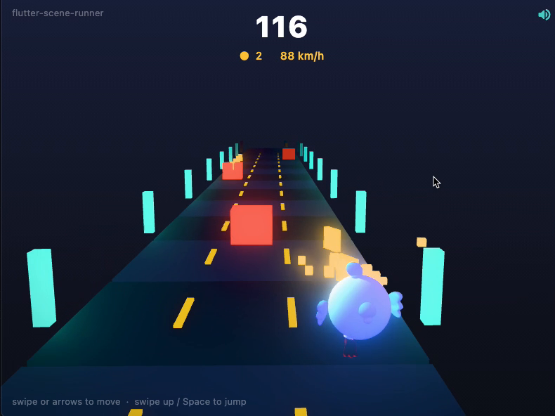
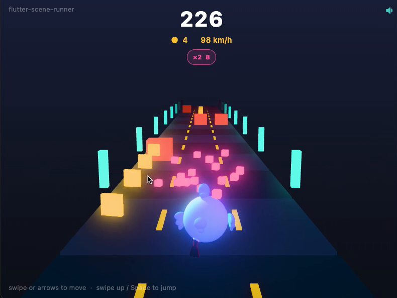
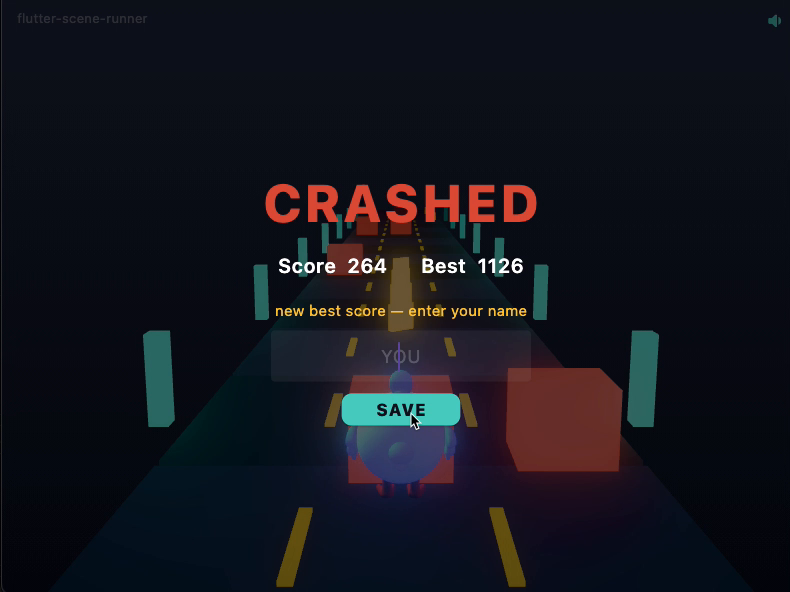

<div align="center">

# 🎮 flutter-scene-runner

### لعبة Endless Runner ثلاثية الأبعاد (3D) مبنية بالكامل بـ Flutter — من غير أي محرّك ألعاب


<p>
  <a href="https://saqrelfirgany.github.io/flutter-scene-runner/">
    
  </a>
</p>

<p>
  
  
  
  
</p>

**أحمد الفرجاني** — Senior Flutter Engineer
<br/>
<a href="https://github.com/saqrelfirgany">GitHub</a> • <a href="https://www.linkedin.com/in/saqrelfirgany/">LinkedIn</a>

</div>

<div dir="rtl">

## نظرة سريعة

`flutter-scene-runner` لعبة **Endless Runner ثلاثية الأبعاد**: تتحكّم في **Dash** (تميمة فلاتر) وهو بيجري في طريق بثلاث حارات، تتفادى العوائق، تجمع العملات، وتمسك باور-أب، والسرعة بتزيد مع الوقت. الحاجة اللافتة إن **كل إطار في اللعبة — الطريق، الشخصية، العوائق، والعملات — عبارة عن 3D حقيقي بيترسم مباشرةً على كارت الرسوميات (GPU) من Dart**، باستخدام `flutter_scene` فوق Flutter GPU / Impeller.

مفيش Unity، ولا Unreal، ولا حتى Flame — **Flutter بس**، من الصفر: scene graph و render loop و post-processing مكتوبين بالإيد.

> **ليه المشروع ده؟** أغلب الناس لسه شايفة إن Flutter للتطبيقات وبس. المشروع ده بياخده لأبعد نقطة — رسم 3D لحظي على الـ GPU — عشان نكتشف حدود الأداة الحقيقية. أسرع طريقة تفهم أداة هي إنك تاخدها لأقصاها.

**▶ العب دلوقتي مباشرة في المتصفح:** [saqrelfirgany.github.io/flutter-scene-runner](https://saqrelfirgany.github.io/flutter-scene-runner/)

</div>

## لقطات من اللعب

<div align="center">
  <table>
    <tr>
      <td align="center"><br/><sub>Dash بيجري · نيون · جمع عملات</sub></td>
      <td align="center"><br/><sub>باور-أب ×2 مُفعّل</sub></td>
      <td align="center"><br/><sub>نهاية اللعبة + أعلى سكور</sub></td>
    </tr>
  </table>
  <sub>▶️ الفيديو الكامل: <a href="assets/hero.mp4">assets/hero.mp4</a></sub>
</div>

<div dir="rtl">

## المميزات

- **3D حقيقي على Flutter GPU** — رسم عبر `Scene.render()` جوه `CustomPainter` مدفوع بـ `Ticker` بسرعة تحديث الشاشة.
- **شخصية Dash ثلاثية الأبعاد** — تميمة فلاتر مستوردة من ملف `.glb` **وقت التشغيل** عبر `Node.fromGlbAsset`، مع مزج أنيميشن حي بين **الوقوف / الجري / القفز** (Idle · Run · Jump) حسب حالة اللعب.
- **مظهر سينمائي (Post-FX)** — توهّج **Bloom** على عناصر النيون، **ضباب مسافة** يذوّب البعيد في الخلفية، **Vignette** وتدرّج ألوان خفيف — كله على مستوى المشهد.
- **باور-أب** — 🧲 مغناطيس يسحب العملات ليك · 🛡️ درع يمتص ضربة · ✖️ ×2 يضاعف السكور — كل واحد أوربة متوهّجة بلونها، مع شارات وعدّاد في الـ HUD.
- **صوت + تحكّم في المستوى** — مؤثرات أصلية للعملة/القفز/الاصطدام/الباور-أب، وزرار يلفّ بين ٣ مستويات (كامل · منخفض · كتم) بيتحفظ.
- **تحكّم لمس وكيبورد** — سحب (swipe) للحارات والقفز على الموبايل/التتش، و`A`/`D`/`←`/`→`/`Space` على الديسكتوب.
- **عالم لا نهائي** — تدوير ذكي لمجموعة ثابتة من عناصر الطريق يخلق مسارًا بلا نهاية من عدد محدود من الكائنات (object pooling).
- **عوائق وأنماط** — عوائق مفردة + **جدران بحارتين** وحارة مفتوحة، مع فحص تصادم (AABB) بيراعي حارتك وارتفاع قفزتك.
- **سكور، أعلى سكور، ومشاركة** — لوحة أفضل ٥ نتائج محفوظة محليًا، إبراز حي لأعلى سكور (`★ NEW BEST`)، وزرار **مشاركة** بينسخ سكورك جاهز للنشر.

</div>

## التحكّم

<div align="center">
  <table>
    <tr><th>الإجراء</th><th>لمس / موبايل</th><th>كيبورد</th></tr>
    <tr><td align="center">تغيير الحارة</td><td align="center">سحب يمين / شمال</td><td align="center"><code>A</code> <code>D</code> · <code>←</code> <code>→</code></td></tr>
    <tr><td align="center">القفز</td><td align="center">سحب لأعلى</td><td align="center"><code>Space</code> · <code>↑</code></td></tr>
    <tr><td align="center">بدء / إعادة</td><td align="center">لمسة</td><td align="center"><code>Space</code></td></tr>
    <tr><td align="center">مستوى الصوت</td><td align="center" colspan="2">زرار السماعة (فوق يمين) — كامل · منخفض · كتم</td></tr>
  </table>
</div>

<div dir="rtl">

## التقنيات والبنية

- **[flutter_scene](https://pub.dev/packages/flutter_scene)** — محرّك 3D واستيراد glTF لـ Flutter (early preview): مواد PBR، إضاءة، وحزمة post-processing كاملة.
- **Flutter GPU + Impeller** — طبقة الرسم منخفضة المستوى (Metal على macOS، وWebGL2 على الويب).
- **[audioplayers](https://pub.dev/packages/audioplayers)** — تشغيل مؤثرات الصوت.
- **shared_preferences** — حفظ لوحة النتائج ومستوى الصوت.
- **vector_math** — تحويلات المتجهات والمصفوفات ثلاثية الأبعاد.

الكود متقسّم لموديولات ضمن **مكتبة واحدة** (`part` / `part of`) عشان يفضل عقد الـ **sim/render split** سليم — المنطق مايلمسش الـ nodes، والرسم بس هو اللي بيكتب الـ transforms:

</div>

```text
lib/
├── main.dart           # نقطة الدخول: Scene init · RunnerApp · GamePage
├── game_state.dart     # كل منطق اللعبة: حركة، سبون، تصادم، باور-أب، صوت، UI
├── game_painter.dart   # الرسم فقط: وضع كل node + الكاميرا + scene.render()
└── models.dart         # الكيانات (Obstacle/Coin/PowerUp/…) + الصوت + دوال الألوان
```

<div dir="rtl">

## التشغيل محليًا

`flutter_scene` بيتطلب قناة **`master`** و Flutter GPU، فالمشروع بيثبّت نسخته بـ [FVM](https://fvm.app) عشان يفضل معزول عن مشاريعك المستقرة.

</div>

```bash
# 1) Flutter master via FVM (a build from 2026-06-09 or newer)
fvm install master
fvm use master

# 2) one-time: enable the native-assets shader bundle
fvm flutter config --enable-native-assets --enable-dart-data-assets
fvm flutter pub get

# 3) run on macOS with Impeller + Flutter GPU
fvm flutter run -d macos --enable-flutter-gpu --enable-impeller

# …or run in the browser (WebGL2, no flags needed)
fvm flutter run -d chrome
```

<div dir="rtl">

## رحلة البناء (Build in Public)

- **اليوم الأول** ✅ — تجهيز بيئة الـ GPU (Impeller + Flutter GPU)، أول رندر 3D، وطريق لا نهائي بإحساس الجري للأمام.
- **اليوم الثاني** ✅ — التنقّل بين الحارات + القفز، ظهور العوائق + الاصطدام، العملات، السكور، تصاعد السرعة، وحلقة الاصطدام/الإعادة.
- **اليوم الثالث** ✅ — قائمة بداية + لوحة أفضل النتائج (محفوظة)، جزيئات ولمسات أخيرة، ونسخة Flutter Web بلينك مباشر.
- **تحسينات ما بعد الإطلاق** ✅ — تحكّم لمس، شخصية Dash (glTF)، إضاءة و post-FX نيون، صوت وتحكّم في المستوى، باور-أب وأنماط عوائق، إبراز/مشاركة السكور، وتنظيم الكود لموديولات.

## عن المطوّر

**أحمد الفرجاني** — مهندس برمجيات موبايل أول (Senior Flutter Engineer)، خبرة أكثر من **5 سنين** في بناء تطبيقات Flutter قابلة للتوسّع.

- **+22 تطبيق** إنتاجي على iOS و Android · **+200 ألف مستخدم**
- خبرة عبر **5 مجالات** (عقارات، تجارة إلكترونية، رعاية صحية، موارد بشرية، فنتك) و**5 دول** — مصر، **السعودية، الإمارات، الكويت**، وتركيا
- Clean Architecture · BLoC · CI/CD · اختبارات · WebSocket / الوقت الفعلي
- مؤلّف **Flutter Enterprise Template** المستخدَم من أكثر من **100 مطوّر**

📬 مفتوح لفرص **Senior / Lead** في تطوير الموبايل، وأعمال freelance مختارة.
<br/>
[GitHub](https://github.com/saqrelfirgany) • [LinkedIn](https://www.linkedin.com/in/saqrelfirgany/)

## اعتمادات

- شخصية **Dash** هي التميمة الرسمية لـ Flutter، والموديل ثلاثي الأبعاد مأخوذ من أمثلة [`flutter_scene`](https://github.com/bdero/flutter_scene) (Brandon DeRosier، رخصة MIT).
- مؤثرات الصوت مُولّدة برمجيًا خصيصًا للمشروع (أصلية 100%).

</div>

<div align="center"><sub>صُنع بواسطة أحمد الفرجاني · flutter-scene-runner · 2026</sub></div>
