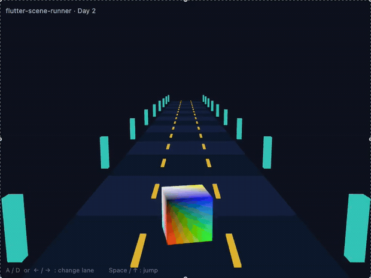

# flutter-scene-runner

A 3D endless runner built from scratch in **Flutter** — no game engine, just [`flutter_scene`](https://pub.dev/packages/flutter_scene) on top of **Flutter GPU**.

Built and documented in public by **Ahmed ElFirgany** ([@saqrelfirgany](https://github.com/saqrelfirgany)).

📷 Screenshot: [`assets/day2.png`](assets/day2.png) · ▶️ Full clip: [`assets/day2.mp4`](assets/day2.mp4)

## Controls

| Key | Action |
| --- | --- |
| `A` / `D` or `←` / `→` | Change lane |
| `Space` / `↑` | Jump |

## Tech stack

- **Flutter** (master channel)
- **flutter_scene** — high-level 3D scene API (nodes, cameras, meshes)
- **Flutter GPU** — low-level rendering, on the Impeller backend

## Status — Day 2

- [x] 3D scene with a perspective camera
- [x] Scrolling track that creates the sense of running
- [x] Three-lane layout
- [x] Lane switching + jump input
- [x] Obstacles placed along the track
- [ ] Collision detection
- [ ] Coins, score & HUD
- [ ] Character model (currently a primitive cube)
- [ ] Speed ramp + game-over state

## Roadmap

- **Day 1** — 3D scene, perspective camera, moving road
- **Day 2** — three lanes, controls, obstacles ✅
- **Day 3** — collision, scoring, and polish

## Why

Most people still think Flutter is only for apps. This project pushes it into real-time 3D to find out where Flutter GPU actually stops — the fastest way to learn a tool's limits is to take it there.

---

Built by Ahmed ElFirgany · follow the build-in-public journey on LinkedIn.
